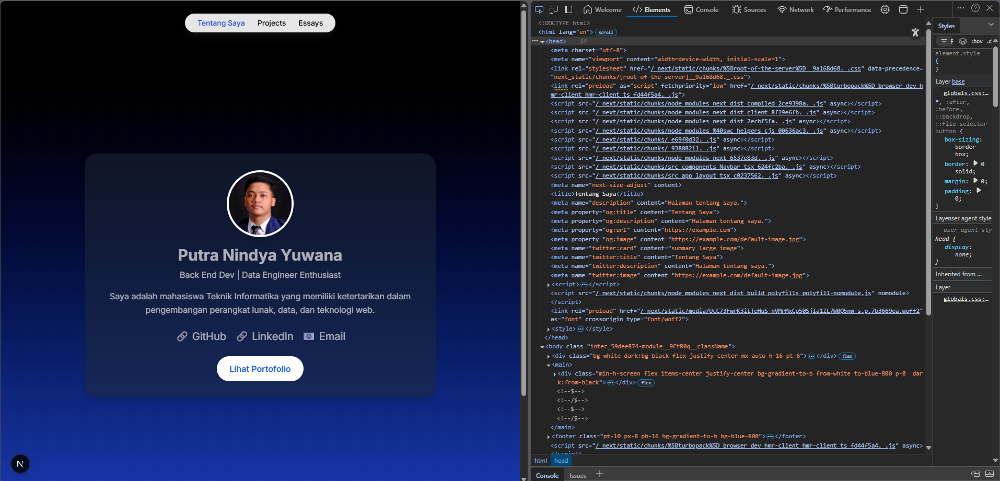

This is a [Next.js](https://nextjs.org) project bootstrapped with [`create-next-app`](https://nextjs.org/docs/app/api-reference/cli/create-next-app).

## Getting Started

First, run the development server:

```bash
npm run dev
# or
yarn dev
# or
pnpm dev
# or
bun dev
```

Open [http://localhost:3000](http://localhost:3000) with your browser to see the result.

You can start editing the page by modifying `app/page.tsx`. The page auto-updates as you edit the file.

This project uses [`next/font`](https://nextjs.org/docs/app/building-your-application/optimizing/fonts) to automatically optimize and load [Geist](https://vercel.com/font), a new font family for Vercel.

## Learn More

To learn more about Next.js, take a look at the      following resources:

- [Next.js Documentation](https://nextjs.org/docs) - learn about Next.js features and API.
- [Learn Next.js](https://nextjs.org/learn) - an interactive Next.js tutorial.

You can check out [the Next.js GitHub repository](https://github.com/vercel/next.js) - your feedback and contributions are welcome!

## Deploy on Vercel

The easiest way to deploy your Next.js app is to use the [Vercel Platform](https://vercel.com/new?utm_medium=default-template&filter=next.js&utm_source=create-next-app&utm_campaign=create-next-app-readme) from the creators of Next.js.

Check out our [Next.js deployment documentation](https://nextjs.org/docs/app/building-your-application/deploying) for more details.


## Laporan Praktikum

|  | Pemrograman Berbasis Framework 2024 |
|--|--|
| NIM |  2241720089 |
| Nama |  Putra Nindya Yuwana |
| Kelas | TI - 3C |
  

### Praktikum 1: Menambahkan Favicon

1. Siapkan file favicon (format .ico) dan letakkan di folder public/.


2. Hapus faveicon.ico yang ada di folder src/app dan Update file src/components/layout.tsx untuk menambahkan favicon:	 


3. Simpan dan jalankan proyek. Favicon akan muncul di tab browser.


### Praktikum 2: Menambahkan Metadata untuk SEO

1. Buat file src/utils/metadata.ts untuk menyimpan metadata default:	


2. Update file src/components/layout.tsx untuk menggunakan metadata default jika tidak ada metadata yang di-pass:	 


3. Update Setiap Halaman untuk dapat mem-pass definisi metadata	 


4. Lanjutkan untuk halaman Proyek dan Esai	 


### Praktikum 3: Menguji SEO

1. Setelah menambahkan metadata, favicon, dan Open Graph Tags, Anda dapat menguji SEO dengan Membuka halaman di browser dan memeriksa elemen HTML menggunakan Developer Tools (Ctrl + Shift + I atau F12).	 
 



### Tugas

1. Gunakan tools seperti Google Search Console untuk memeriksa performa SEO dari suatu website.	
 


~ ~ TERIMA KASIH ~ ~


